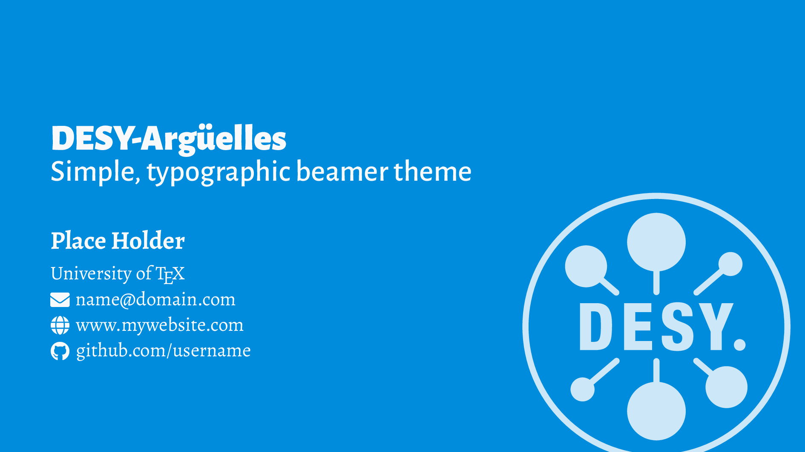
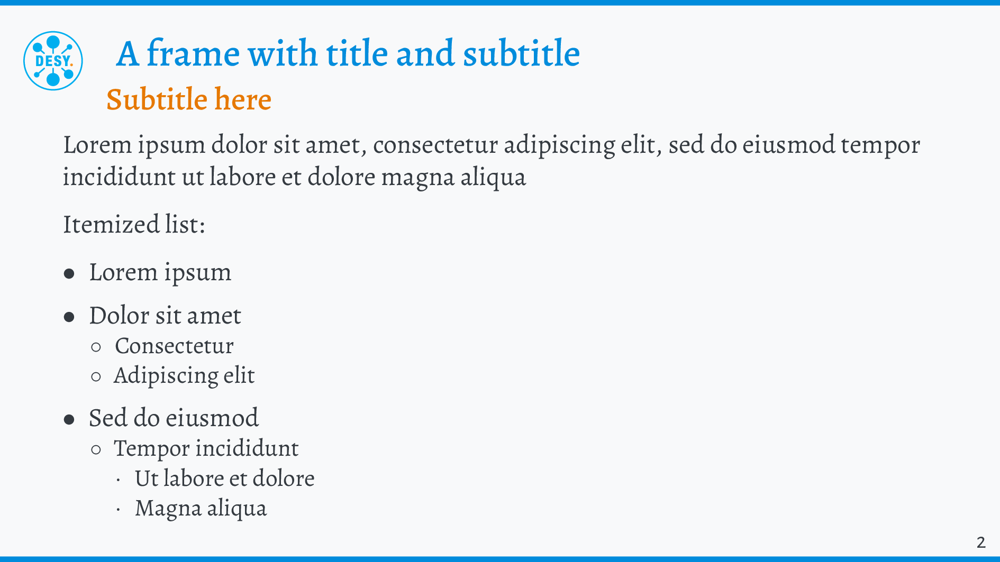
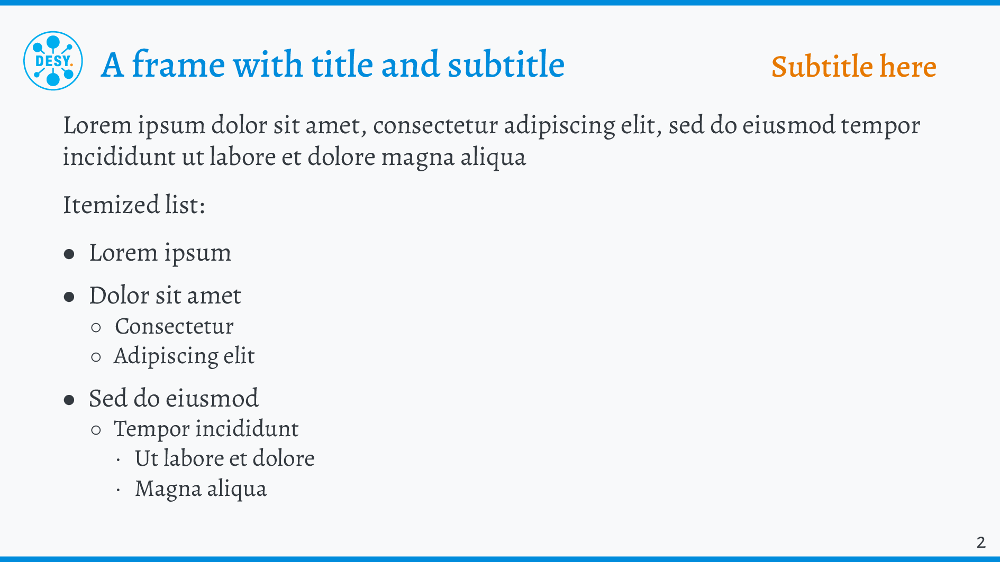

<!--
DESY Beamer theme (fork of Arguelles v2.4.2)
original author: Michele Piazzai — https://github.com/piazzai
modifications: Saverio Monaco — https://github.com/SaverioMonaco/DESY-arguelles
license: MIT (inherited from upstream)
-->

Fork from: https://github.com/piazzai/arguelles

# DESY-arguelles



The theme requires the packages [alegreya](https://ctan.org/pkg/alegreya), [eulervm](https://ctan.org/pkg/eulervm), [mathalpha](https://www.ctan.org/pkg/mathalpha), [microtype](https://ctan.org/pkg/microtype), [fontawesome5](https://ctan.org/pkg/fontawesome5), [opencolor](https://www.ctan.org/pkg/opencolor), [enumitem](https://www.ctan.org/pkg/enumitem), [parskip](https://www.ctan.org/pkg/parskip), [pgf](https://ctan.org/pkg/pgf), and [tcolorbox](https://ctan.org/pkg/tcolorbox) to be installed on your computer. These are included in common LaTeX distributions, such as MiKTeX and TeXLive.

## Installation

It can be installed manually by cloning this repository in your `$HOME/texmf/tex/latex` folder, which is automatically searched by LaTeX. If you do not have this folder, you can [create one](https://www.ias.edu/math/computing/faq/local-latex-style-files).

## Usage

By default, the theme uses serif fonts for body text. Loading it with the `sans` option makes sans-serif fonts default, keeping serif only for math type. Because sans-serif font is more space-efficient, this could be useful for slides that contain more text and bullet points.

The `frameno` option adds frame numbering in the bottom right corner of each frame. Frame numbers remain hidden on title and plain frames. They can also be suppressed on individual frames by adding the `noframenumbering` option to the `frame` environment, as in:

```tex
\begin{frame}[noframenumbering]
...
\end{frame}

```

The `vert` option changes the layout of the title and subtitle in each frame:

* with `vert`:
    

* without `vert`:
    
